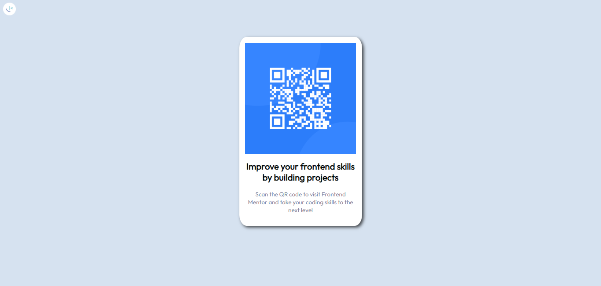

# Frontend Mentor - QR code component

## Welcome! 👋

This front-end coding challenge.

## Description

The challenge was to build out this QR code component and get it looking as close to the design as possible. Hovering effect was also added to CSS.

## Deployment

## Screenshot

## License
Licensed under MIT License.

